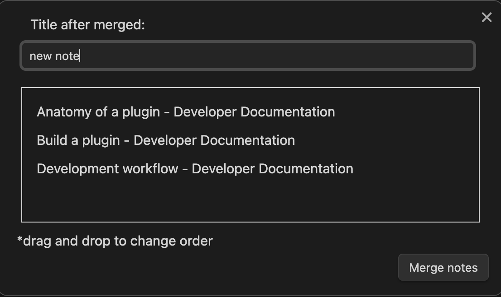

# Merge Notes

`Merge Notes` is a plugin for [Obsidian](https://obsidian.md/) that allows you to merge notes selected in the context menu into a single note.

## How to use

Select the notes you want to merge in the file explorer.

Right click on the selection and select `Merge Notes`.

You can specify the file name of the new note after the merge by its title.

If the note name is long, a popup will also appear to confirm the name.

Notes to be merged can be rearranged by drag-and-drop.

Click the `Merge Notes` button to execute the merge.

The merged note will be created in the same folder as the first note in the selection.

## Limitations

Merged notes are not currently deleted. Delete function will be supported at a later date.

## Open source libraries

- [@dnd-kit](https://docs.dndkit.com/)
